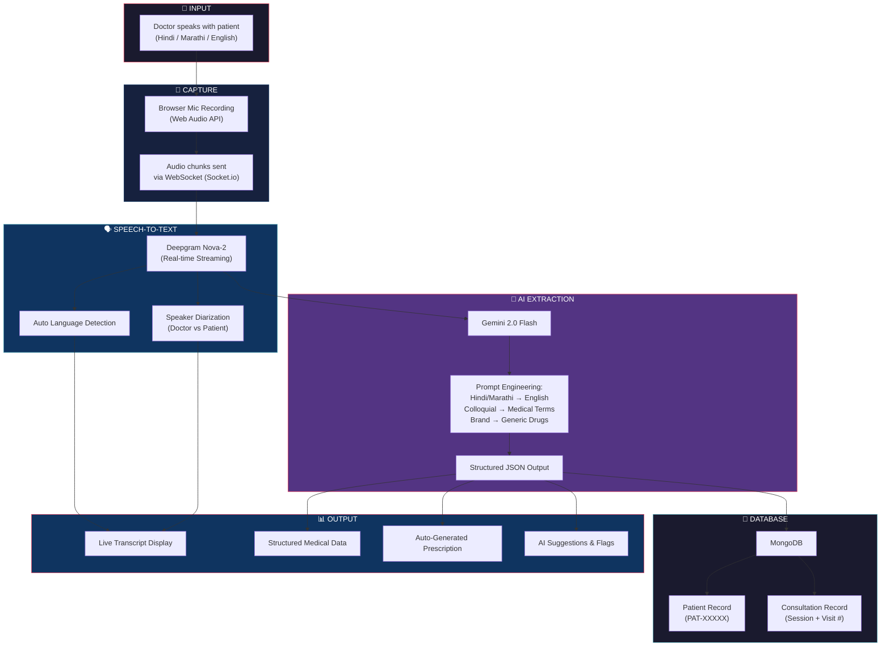
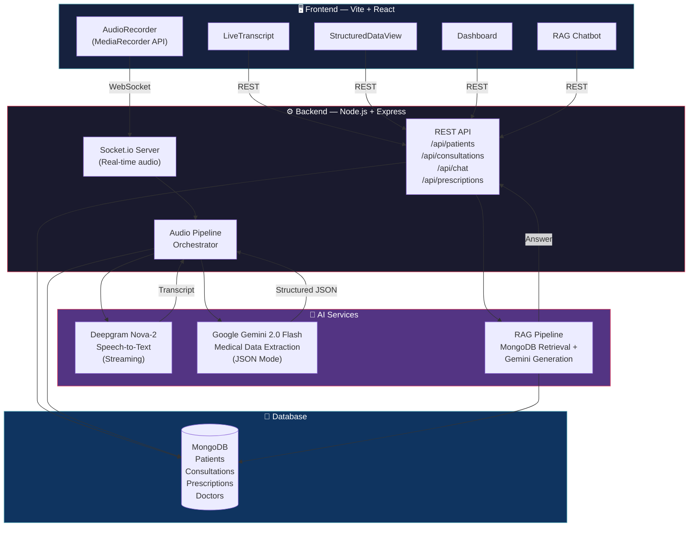
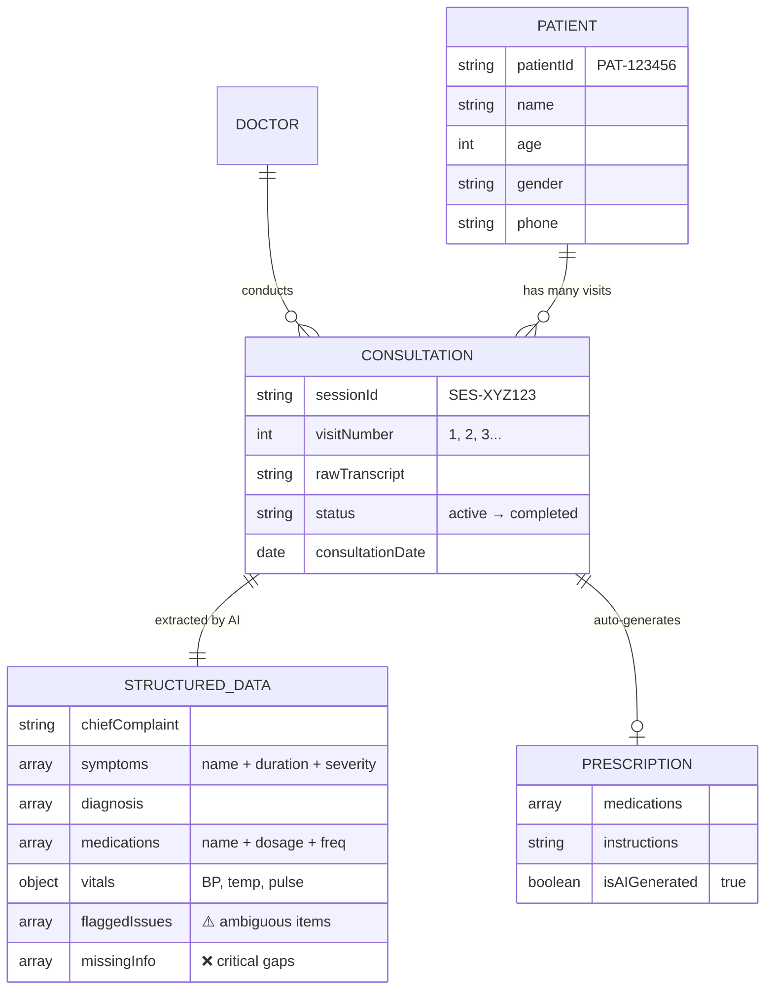

# 🏥 VoiceCare — System Flow Diagrams
> Share these with your team to understand the full pipeline.

---

## 1. End-to-End MVP Flow (The Big Picture)

---

## 2. Real-Time Audio Pipeline (WebSocket)

```mermaid
sequenceDiagram
    participant 👨‍⚕️ as Doctor + Patient
    participant 🖥️ as Frontend
    participant 🔌 as Socket.io
    participant 🎤 as Deepgram ASR
    participant 🧠 as Gemini LLM
    participant 💾 as MongoDB

    👨‍⚕️->>🖥️: Start consultation
    🖥️->>🔌: audio:start {patientId}
    🔌->>💾: Create consultation (status: active)
    🔌->>🎤: Open live stream
    🔌-->>🖥️: audio:ready {sessionId}

    rect rgb(30, 50, 80)
        Note over 👨‍⚕️,🎤: Live Recording Loop
        👨‍⚕️->>🖥️: Speaking...
        🖥️->>🔌: audio:chunk (every 250ms)
        🔌->>🎤: Forward audio buffer
        🎤-->>🔌: Interim transcript
        🔌-->>🖥️: transcript:interim {text, lang}
        🎤-->>🔌: Final transcript segment
        🔌-->>🖥️: transcript:final {text, lang}
    end

    👨‍⚕️->>🖥️: Stop recording
    🖥️->>🔌: audio:stop
    🔌->>🎤: Close stream

    rect rgb(60, 30, 80)
        Note over 🔌,💾: AI Extraction Pipeline
        🔌-->>🖥️: extraction:progress (30%)
        🔌->>🧠: Full transcript + languages
        🧠-->>🔌: Structured JSON
        🔌-->>🖥️: extraction:progress (70%)
        🔌->>🧠: Generate doctor suggestions
        🧠-->>🔌: Diagnoses + Warnings
        🔌-->>🖥️: extraction:progress (90%)
        🔌->>💾: Save complete consultation
    end

    🔌-->>🖥️: extraction:complete {structuredData, suggestions}
    🖥️-->>👨‍⚕️: Display results
```

---

## 3. What the LLM Actually Does

```mermaid
flowchart LR
    subgraph IN["Raw Transcript"]
        T1["'Doctor: Kya problem hai?<br/>Patient: Mujhe 3 din se<br/>bukhar hai aur sir mein<br/>bahut dard ho raha hai.<br/>Doctor: Temperature check<br/>karo... 101 hai. Crocin<br/>500mg do din mein<br/>teen baar, 5 din ke liye'"]
    end

    subgraph PROCESS["Gemini 2.0 Flash"]
        P1["🔤 Language Detection<br/>Hindi detected"]
        P2["🏥 Medical Term Mapping<br/>bukhar → Fever<br/>sir dard → Headache"]
        P3["💊 Drug Normalization<br/>Crocin → Paracetamol"]
        P4["⚠️ Missing Info Check"]
    end

    subgraph OUT["Structured JSON"]
        O1["✅ Chief Complaint:<br/>'Fever with headache'"]
        O2["✅ Symptoms:<br/>- Fever (3 days, moderate)<br/>- Headache (3 days, severe)"]
        O3["✅ Vitals:<br/>Temp: 101°F"]
        O4["✅ Medications:<br/>Paracetamol 500mg<br/>3x daily, 5 days"]
        O5["⚠️ Missing:<br/>- Allergy status<br/>- BP not recorded"]
    end

    IN --> PROCESS --> OUT

    style IN fill:#1a1a2e,color:#fff
    style PROCESS fill:#533483,color:#fff
    style OUT fill:#0f3460,color:#fff
```

---

## 4. Tech Stack Map

---

## 5. Database Relationships

---

## 6. Team Task Division

```mermaid
flowchart LR
    subgraph T1["👤 Person 1: Frontend"]
        A1["Audio Recorder Component"]
        A2["Live Transcript UI"]
        A3["Dashboard + Patient List"]
        A4["Structured Data Cards"]
    end

    subgraph T2["👤 Person 2: Backend + AI"]
        B1["Express Server + Socket.io"]
        B2["Deepgram ASR Integration"]
        B3["Gemini Prompt Engineering"]
        B4["MongoDB Models + Routes"]
    end

    subgraph T3["👤 Person 3: Features + Polish"]
        C1["RAG Chatbot"]
        C2["Doctor Assist Panel"]
        C3["Prescription Generation"]
        C4["UI Polish + Animations"]
    end

    T1 <-->|Socket.io + REST| T2
    T2 <-->|RAG + Assist APIs| T3
    T1 <-->|Chat + Assist UI| T3

    style T1 fill:#16213e,color:#fff,stroke:#53a8b6
    style T2 fill:#533483,color:#fff,stroke:#e94560
    style T3 fill:#0f3460,color:#fff,stroke:#e94560
```

---

## Quick Reference: API Endpoints

| Method | Endpoint | What it does |
|--------|----------|-------------|
| `POST` | `/api/patients` | Register new patient |
| `GET` | `/api/patients?q=search` | Search patients |
| `GET` | `/api/patients/:id/history` | Full visit history |
| `POST` | `/api/consultations` | Process audio/transcript → structured data |
| `GET` | `/api/consultations/:sessionId` | Get consultation result |
| `POST` | `/api/chat` | Ask AI about patient history (RAG) |
| `POST` | `/api/prescriptions` | Auto-generate prescription |
| `WS` | `audio:start → audio:chunk → audio:stop` | Live recording pipeline |
