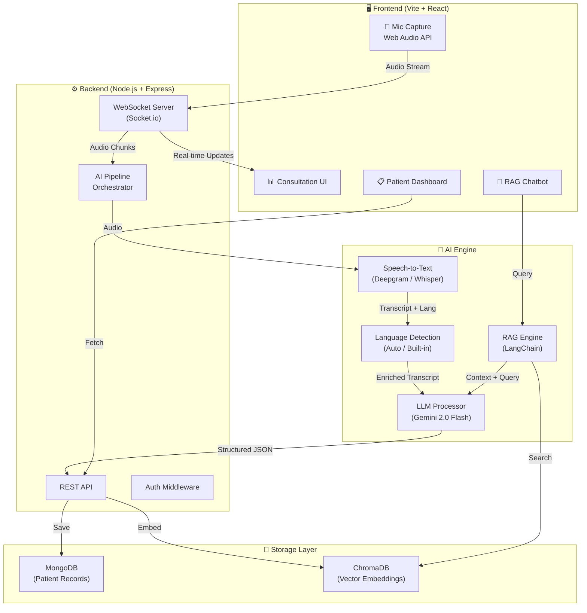
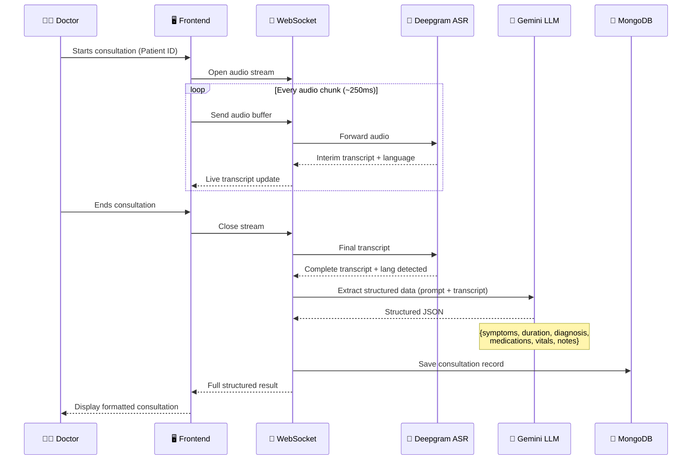
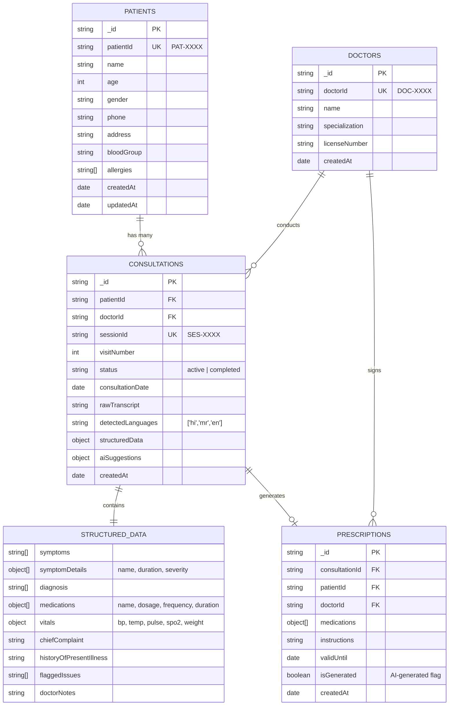
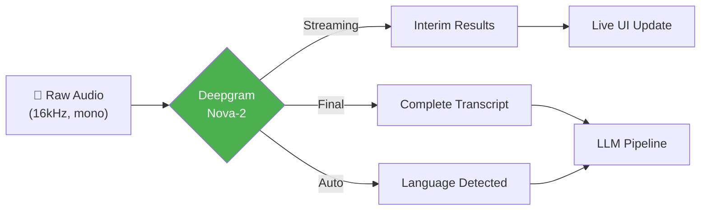
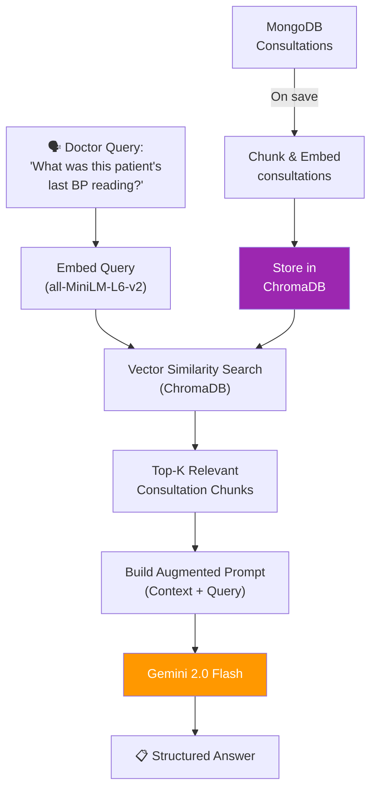
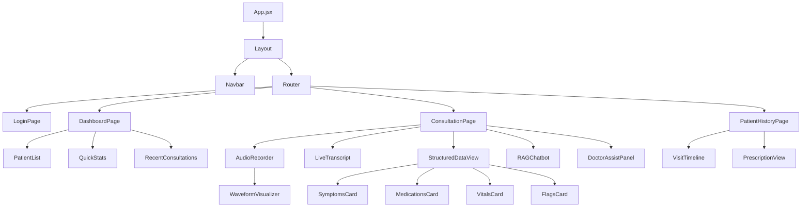

# 🏥 VoiceCare — System Architecture
## Voice-Driven AI Clinic Assistant

---

## 1. High-Level Architecture



---

## 2. Tech Stack

| Layer | Technology | Why |
|-------|-----------|-----|
| **Frontend** | Vite + React | Blazing fast HMR, lightweight, rapid prototyping |
| **Styling** | Vanilla CSS (dark medical theme) | Full control, premium look |
| **Backend** | Node.js + Express | Fast I/O, great ecosystem, JS everywhere |
| **Real-time** | Socket.io | Bidirectional streaming for live transcription |
| **ASR (Speech-to-Text)** | Deepgram Nova-2 | Best real-time streaming, Hindi/Marathi support, handles noise |
| **Fallback ASR** | OpenAI Whisper API | Excellent multilingual, handles code-switching |
| **LLM** | Google Gemini 2.0 Flash | Fast, cheap, excellent at structured JSON extraction |
| **Database** | MongoDB + Mongoose | Flexible schema for medical records, fast setup |
| **Vector DB** | ChromaDB | Local, zero-config, perfect for RAG hackathon |
| **RAG Framework** | LangChain.js | Orchestrates retrieval + generation pipeline |
| **Auth** | Simple JWT | Lightweight doctor authentication |

---

## 3. Core Data Flow



---

## 4. Database Schema



---

## 5. API Design

### REST Endpoints

```
┌─────────────────────────────────────────────────────────────────┐
│  PATIENTS                                                       │
├─────────────────────────────────────────────────────────────────┤
│  POST   /api/patients              → Create patient             │
│  GET    /api/patients/:id          → Get patient profile        │
│  GET    /api/patients/search?q=    → Search patients            │
│  GET    /api/patients/:id/history  → Full visit history         │
│  PUT    /api/patients/:id          → Update patient info        │
├─────────────────────────────────────────────────────────────────┤
│  CONSULTATIONS                                                  │
├─────────────────────────────────────────────────────────────────┤
│  POST   /api/consultations              → Start new session     │
│  GET    /api/consultations/:id          → Get consultation      │
│  PATCH  /api/consultations/:id          → Update (add data)     │
│  GET    /api/consultations/:id/summary  → AI-formatted summary  │
├─────────────────────────────────────────────────────────────────┤
│  PRESCRIPTIONS                                                  │
├─────────────────────────────────────────────────────────────────┤
│  POST   /api/prescriptions              → Generate prescription │
│  GET    /api/prescriptions/:id          → Get prescription      │
│  GET    /api/prescriptions/:id/pdf      → Download as PDF       │
├─────────────────────────────────────────────────────────────────┤
│  RAG CHATBOT                                                    │
├─────────────────────────────────────────────────────────────────┤
│  POST   /api/chat                       → Ask question (RAG)    │
│  GET    /api/chat/history/:sessionId    → Chat history           │
├─────────────────────────────────────────────────────────────────┤
│  AUTH                                                           │
├─────────────────────────────────────────────────────────────────┤
│  POST   /api/auth/login                 → Doctor login          │
│  POST   /api/auth/register              → Register doctor       │
└─────────────────────────────────────────────────────────────────┘
```

### WebSocket Events

```
┌─────────────────────────────────────────────────────────────────┐
│  CLIENT → SERVER                                                │
├─────────────────────────────────────────────────────────────────┤
│  audio:start     { patientId, sessionId }                       │
│  audio:chunk     { audioBuffer, timestamp }                     │
│  audio:stop      { sessionId }                                  │
├─────────────────────────────────────────────────────────────────┤
│  SERVER → CLIENT                                                │
├─────────────────────────────────────────────────────────────────┤
│  transcript:interim    { text, language, confidence }            │
│  transcript:final      { fullText, languages[] }                │
│  extraction:progress   { stage, percent }                       │
│  extraction:complete   { structuredData, suggestions }           │
│  error                 { code, message }                        │
└─────────────────────────────────────────────────────────────────┘
```

---

## 6. AI Pipeline Detail

### 6.1 Speech-to-Text (ASR)



**Deepgram Config:**
```json
{
  "model": "nova-2",
  "language": ["hi", "mr", "en"],
  "detect_language": true,
  "smart_format": true,
  "diarize": true,
  "punctuate": true,
  "filler_words": false,
  "multichannel": false,
  "encoding": "linear16",
  "sample_rate": 16000
}
```

> [!NOTE]
> **Why Deepgram over Whisper for real-time?**  
> Deepgram Nova-2 supports true streaming with ~300ms latency. Whisper requires full audio file upload (batch only). For the real-time UI, we use Deepgram. For post-processing accuracy (especially code-switching), we can optionally re-run through Whisper.

### 6.2 LLM Structured Extraction

**Prompt Engineering Strategy:**

```
SYSTEM PROMPT:
You are a medical transcription AI specializing in Indian healthcare.
You receive doctor-patient consultation transcripts in mixed languages
(Hindi, Marathi, English). Extract structured medical data.

RULES:
1. ALL output must be in English regardless of input language
2. Translate all symptoms, diagnoses, and medications to English
3. Map colloquial descriptions to medical terminology
   - "pet mein dard" → "Abdominal pain"
   - "sir dard" → "Headache"  
   - "doka dukhat aahe" → "Headache" (Marathi)
4. Standardize medication names to generic names
5. Flag ambiguous statements for doctor review
6. Flag if critical information is MISSING

OUTPUT FORMAT (strict JSON):
{
  "chiefComplaint": "string",
  "symptoms": [
    { "name": "string", "duration": "string", "severity": "mild|moderate|severe", "notes": "string" }
  ],
  "diagnosis": ["string"],
  "medications": [
    { "name": "string", "dosage": "string", "frequency": "string", "duration": "string", "route": "oral|iv|topical" }
  ],
  "vitals": { "bp": "string", "temp": "string", "pulse": "string", "spo2": "string", "weight": "string" },
  "allergies": ["string"],
  "flaggedIssues": ["string"],      // ambiguous or concerning items
  "missingInfo": ["string"],         // critical info not mentioned
  "followUp": "string",
  "languagesDetected": ["string"]
}
```

### 6.3 RAG Pipeline (Nice-to-Have)



---

## 7. Frontend Component Tree



---

## 8. Project Structure

```
partex-ai/
├── client/                          # Frontend (Vite + React)
│   ├── public/
│   ├── src/
│   │   ├── assets/                  # Icons, images
│   │   ├── components/
│   │   │   ├── layout/
│   │   │   │   ├── Navbar.jsx
│   │   │   │   └── Layout.jsx
│   │   │   ├── consultation/
│   │   │   │   ├── AudioRecorder.jsx
│   │   │   │   ├── LiveTranscript.jsx
│   │   │   │   ├── StructuredDataView.jsx
│   │   │   │   ├── WaveformVisualizer.jsx
│   │   │   │   └── DoctorAssistPanel.jsx
│   │   │   ├── patient/
│   │   │   │   ├── PatientList.jsx
│   │   │   │   ├── PatientForm.jsx
│   │   │   │   └── VisitTimeline.jsx
│   │   │   ├── chat/
│   │   │   │   └── RAGChatbot.jsx
│   │   │   └── common/
│   │   │       ├── Card.jsx
│   │   │       ├── Button.jsx
│   │   │       └── Modal.jsx
│   │   ├── pages/
│   │   │   ├── LoginPage.jsx
│   │   │   ├── DashboardPage.jsx
│   │   │   ├── ConsultationPage.jsx
│   │   │   └── PatientHistoryPage.jsx
│   │   ├── hooks/
│   │   │   ├── useAudioRecorder.js
│   │   │   ├── useSocket.js
│   │   │   └── usePatient.js
│   │   ├── services/
│   │   │   ├── api.js
│   │   │   └── socket.js
│   │   ├── context/
│   │   │   └── AuthContext.jsx
│   │   ├── utils/
│   │   │   └── formatters.js
│   │   ├── App.jsx
│   │   ├── main.jsx
│   │   └── index.css
│   ├── index.html
│   ├── vite.config.js
│   └── package.json
│
├── server/                          # Backend (Node.js + Express)
│   ├── src/
│   │   ├── config/
│   │   │   ├── db.js                # MongoDB connection
│   │   │   ├── deepgram.js          # Deepgram client
│   │   │   ├── gemini.js            # Gemini client
│   │   │   └── chroma.js            # ChromaDB client
│   │   ├── models/
│   │   │   ├── Patient.js
│   │   │   ├── Consultation.js
│   │   │   ├── Prescription.js
│   │   │   └── Doctor.js
│   │   ├── routes/
│   │   │   ├── patients.js
│   │   │   ├── consultations.js
│   │   │   ├── prescriptions.js
│   │   │   ├── chat.js
│   │   │   └── auth.js
│   │   ├── services/
│   │   │   ├── asrService.js        # Deepgram integration
│   │   │   ├── llmService.js        # Gemini structured extraction
│   │   │   ├── ragService.js        # RAG pipeline
│   │   │   └── prescriptionService.js
│   │   ├── socket/
│   │   │   └── audioHandler.js      # WebSocket audio pipeline
│   │   ├── middleware/
│   │   │   ├── auth.js
│   │   │   └── errorHandler.js
│   │   ├── prompts/
│   │   │   ├── extraction.js        # Medical data extraction prompt
│   │   │   ├── diagnosis.js         # Doctor assist prompt
│   │   │   └── chatbot.js           # RAG chatbot prompt
│   │   └── utils/
│   │       ├── idGenerator.js       # PAT-XXXX, SES-XXXX generators
│   │       └── validators.js
│   ├── server.js                    # Entry point
│   └── package.json
│
├── .env                             # API keys (gitignored)
├── .gitignore
├── README.md
└── package.json                     # Root workspace
```

---

## 9. Environment Variables

```env
# Server
PORT=5000
NODE_ENV=development

# MongoDB
MONGODB_URI=mongodb://localhost:27017/voicecare

# Deepgram (ASR)
DEEPGRAM_API_KEY=your_deepgram_key

# Google Gemini (LLM)
GEMINI_API_KEY=your_gemini_key

# ChromaDB
CHROMA_URL=http://localhost:8000

# JWT
JWT_SECRET=your_jwt_secret
JWT_EXPIRES_IN=24h
```

---

## 10. Build Plan (9-Hour Sprint)

### Phase 1: The Plumbing (Hours 0–2) 🔧

| Task | Time | Details |
|------|------|---------|
| Project scaffolding | 20 min | Vite + Express setup, monorepo structure |
| MongoDB models | 20 min | Patient, Consultation, Doctor schemas |
| API boilerplate | 30 min | CRUD routes for patients & consultations |
| Audio recorder component | 30 min | MediaRecorder API, waveform viz |
| Socket.io setup | 20 min | Client ↔ Server audio streaming |

### Phase 2: The Brain (Hours 2–6) 🧠

| Task | Time | Details |
|------|------|---------|
| Deepgram integration | 45 min | Streaming ASR with language detection |
| Live transcript UI | 30 min | Real-time display with language badges |
| LLM prompt engineering | 60 min | Medical extraction prompt, iterate |
| Structured data pipeline | 45 min | Transcript → Gemini → JSON → DB |
| End-to-end MVP test | 30 min | Record → Transcribe → Extract → Save |
| Edge case handling | 30 min | Noise, code-switching, ambiguity |

### Phase 3: Memory & UI (Hours 6–8) 🎨

| Task | Time | Details |
|------|------|---------|
| Dashboard page | 30 min | Patient list, recent consultations |
| Consultation results UI | 30 min | Beautiful structured data display |
| Patient history timeline | 20 min | Multi-session visit tracking |
| RAG chatbot | 40 min | ChromaDB + LangChain + chat UI |
| Doctor assist panel | 20 min | AI suggestions, missing info flags |

### Phase 4: Polish & Pitch (Hours 8–9) ✨

| Task | Time | Details |
|------|------|---------|
| UI polish & animations | 20 min | Micro-animations, transitions |
| Bug fixes | 20 min | Edge cases, error handling |
| Demo recording | 10 min | Backup video of working demo |
| Pitch prep | 10 min | Key talking points |

---

## 11. Key Design Decisions

### Why Deepgram over Google Cloud Speech?
- **True streaming** with WebSocket (not REST polling)
- **Built-in diarization** (who is speaking — doctor vs patient)
- **Better noise handling** for OPD environments
- Hindi/Marathi support via `nova-2` model
- Simpler SDK, faster integration

### Why Gemini 2.0 Flash over GPT-4?
- **3x faster** response times for structured extraction
- **Cheaper** per-token cost (critical for hackathon budget)
- Excellent at **JSON mode** (guaranteed valid JSON output)
- Strong multilingual understanding

### Why MongoDB over PostgreSQL?
- **Flexible schema** — medical data varies by consultation
- **Nested documents** — structuredData embeds naturally
- **Fast setup** — no migration scripts needed
- **Mongoose** provides validation without rigidity

### Why Socket.io over raw WebSocket?
- **Auto-reconnection** (critical for hospital WiFi)
- **Room support** (isolate consultation sessions)
- **Fallback to polling** if WebSocket fails
- **Event-based API** is cleaner for audio streaming

---

## 12. Edge Case Strategy

| Edge Case | Solution |
|-----------|----------|
| **Background noise (OPD)** | Deepgram's noise reduction + set `endpointing` to 500ms |
| **Ambiguous answers** ("wo wali tablet") | LLM flags in `flaggedIssues[]`, UI highlights for doctor |
| **Similar drug names** (Paracetamol vs Pantoprazole) | LLM prompt includes drug disambiguation rules + confidence scoring |
| **Code-switching mid-sentence** | Deepgram `detect_language` + Whisper post-processing fallback |
| **Incomplete consultation** | LLM populates `missingInfo[]` — UI shows checklist before closing |
| **Poor connectivity** | Socket.io auto-reconnect + local audio buffer with retry queue |
| **Multiple patients same name** | Unique `patientId` (PAT-XXXX) + phone number verification |

---

## 13. Security Considerations

> [!IMPORTANT]
> Medical data is sensitive. Even for a hackathon MVP:

- **HTTPS only** in production
- **JWT auth** for all API routes
- **No PHI in logs** — redact patient names from server logs
- **API keys in `.env`** — never committed to git
- **MongoDB auth** enabled 
- **Input sanitization** on all user inputs

---

## 14. Scoring Strategy (100 Points)

| Category | Points | Our Coverage |
|----------|--------|-------------|
| **Core AI Engine** (ASR + LLM) | 35 | ✅ Deepgram streaming + Gemini extraction + language detection |
| **MVP Execution** (E2E flow) | 25 | ✅ Voice → Transcript → JSON → MongoDB → UI |
| **Real-World Resilience** | 15 | ✅ Noise handling, drug disambiguation, flagged issues |
| **Expansions** | 15 | ✅ RAG chatbot + multi-session + code-switching + doctor assist |
| **UX & Pitch** | 10 | ✅ Premium dark UI, micro-animations, intuitive workflow |
| **TOTAL** | **100** | **Full coverage** |
